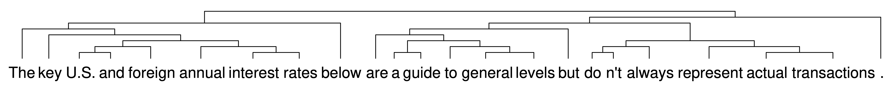
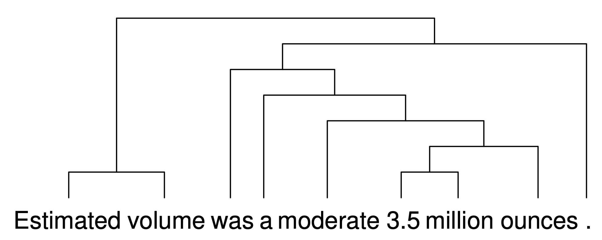
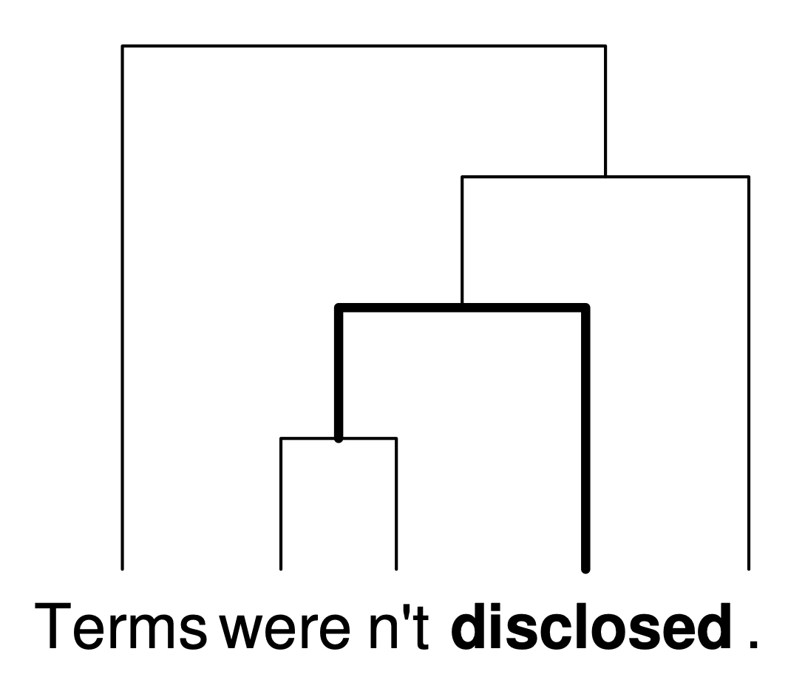
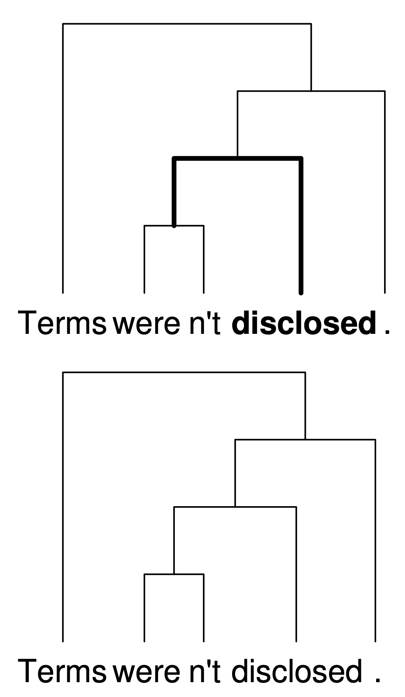

# Turtle Tree

Programmatically draw trees over sentences. Supports binary and n-ary trees.

## Setup

```
conda create -n turtle-tree python=3.6 -y
conda activate turtle-tree
pip install PyPDF2
# Built-in for Python 3+
# https://docs.python.org/3/library/turtle.html
# pip install turtle
```

## Usage

```
# To run some examples.
bash run_examples.sh
```

### Draw trees that take minimal vertical space.





```
python main.py \
    --inp_file examples/examples.jsonl \
    --tree_ids ptb01094,ptb02218 \
    --tree_key tree \
    --prefix demo_run_some \
    --out_dir examples/out
```

### Emphasize edges and text using the input file.



```
python main.py \
    --inp_file examples/examples.jsonl \
    --tree_ids ptb01035 \
    --tree_key tree \
    --prefix demo_style \
    --out_dir examples/out
```

### Stitch multiple images together.



```
python main.py \
    --inp_file examples/examples.jsonl,examples/examples-2.jsonl \
    --tree_ids ptb01035 \
    --tree_key tree,tree \
    --prefix demo_stitch_1,demo_stitch_2 \
    --out_dir examples/out
```
